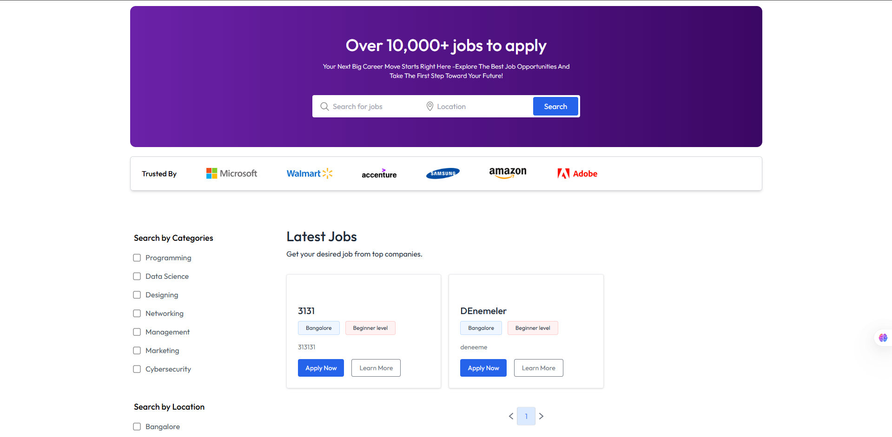
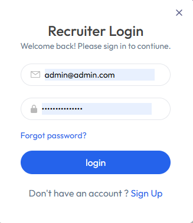
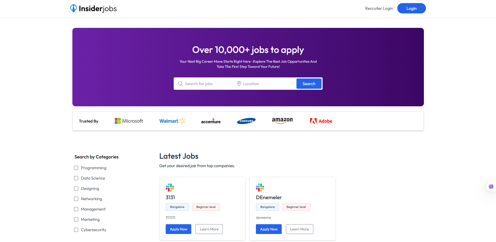
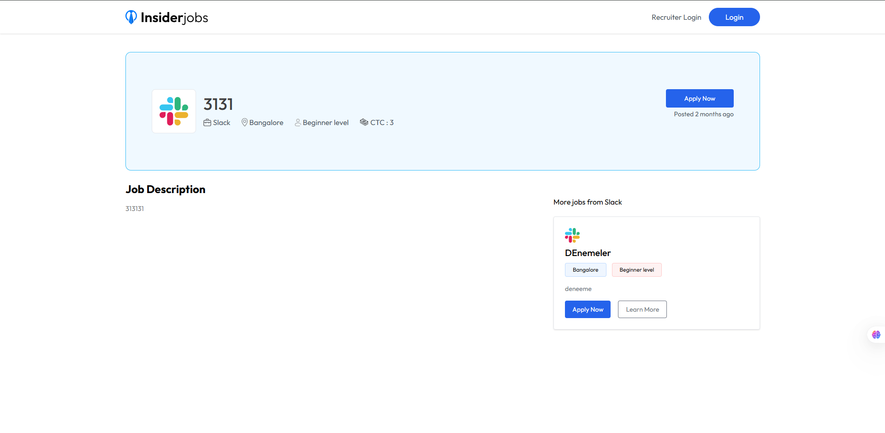

# 💼 Job Portal Web Application

Bu proje, React.js ve Node.js teknolojileri kullanılarak geliştirilmiş tam kapsamlı bir iş ilanı portalıdır. Kullanıcılar çeşitli kategorilerdeki iş ilanlarını filtreleyebilir, detayları görüntüleyebilir ve başvuru yapabilir.

## 🛠️ Kullanılan Teknolojiler

### Frontend (client/)
- **React.js** – Modern kullanıcı arayüzü
- **Vite** – Hızlı geliştirme ve build işlemleri
- **Tailwind CSS** – Responsive tasarım için yardımcı CSS framework
- **PostCSS** – Tailwind yapılandırması
- **eslint** – Kod kalitesini korumak için

### Backend (server/)
- **Node.js & Express.js** – RESTful API servisi
- **MongoDB** – NoSQL veritabanı yönetimi (mongoose ile)
- **Multer** – Dosya yükleme işlemleri (örn. CV)
- **Custom Middleware** – Hata yakalama ve yetkilendirme işlemleri

## 🖼️ Ekran Görüntüleri

### 1. Ana Sayfa Arayüzü

### 2. Filtreleme Paneli

### 3. İş Kartı Detayı

### 4. Sayfalama ve Başvuru

